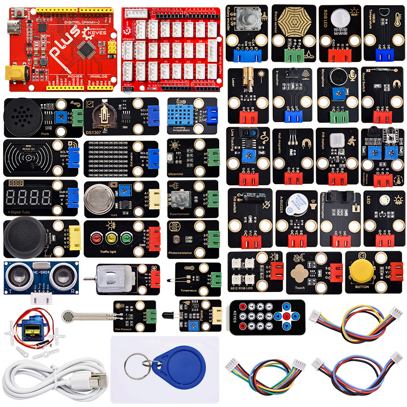

# KE3025-KE3025S-KE3026-KE3026S-KE3093-KE3093S Keyes Arduino DIY电子积木 37合1 传感器套装

## **产品介绍**

Keyes Arduino DIY电子积木 37合1
传感器套装主要包含了我们常用的37款传感器/模块，还有对应的Keyes Uno Plus
开发板、传感器扩展板和连接线。37款传感器/模块上都带有防反接口，和我们提供的传感器扩展板接口完全匹配。使
用时，我们只需要将传感器扩展板堆叠在Keyes Uno Plus
开发板，利用1根自带的连接线将传感器/模块连接在扩展板上，简单方便。
为了让你对这个37款传感器/模块有更深入的了解，我们还基于这个37款传感器/模块做个多个学习课程。这些课程是
利用arduino IDE软件平台制作的，课程中我们提供了对应的原理图、接线方法、c语言代码、实验结果和简单的代码
介绍等信息。通过这些课程，可以让我们对编程方法、逻辑、电子电路有了更深刻的理解。

## [点击跳转到教程](https://d.2h.hk/@s/kfPMDUlt)

注意：如果没有跳转成功刷新一下就行

